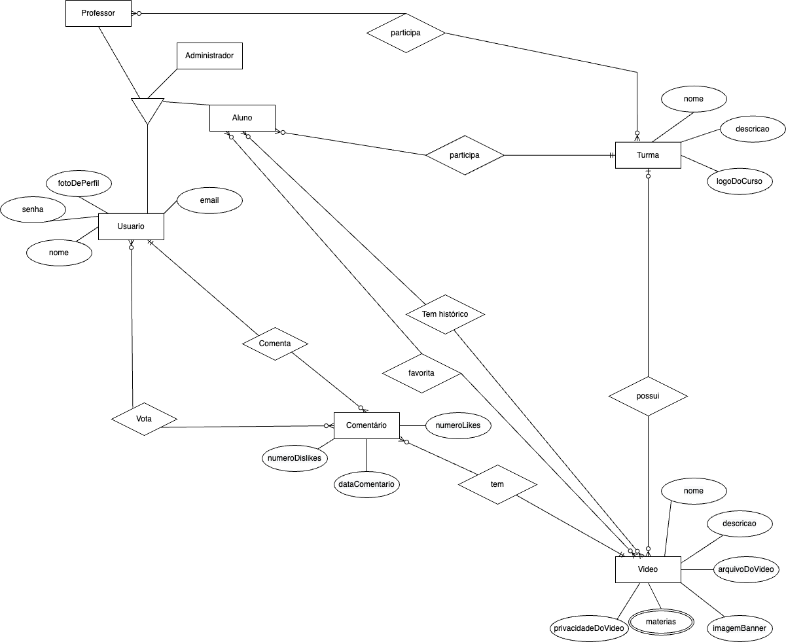
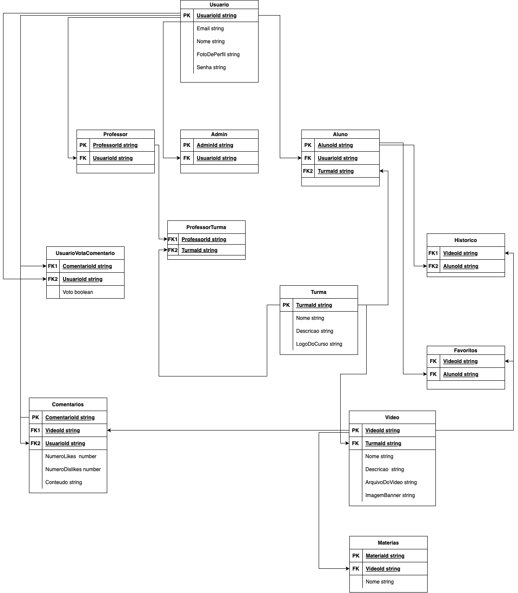

# Portal de videos Raro Academy - Raro Tube

Projeto final da turma de nodejs da Raro Academy

## Instalação

Clonar o repositório :

```bash
git clone https://gitlab.com/SantosMatheus8/trabalho-final-grupo02.git
```

Trocar para o arquivo do repositório :

```bash
cd trabalho-final-grupo02
```

Instalas as dependencias :

```bash
npm install
```

## dev

Comando utilizado para iniciar o projeto em modo de desenvolvimento

```bash
npm run dev
```

## typeorm

Este comando é um atalho para o typeorm, que está instalado localmente, no projeto, os comandos podem ser diferentes dependendo do sistema operacional.

```bash
npm run typeorm migration:create -- -n nomeDaMigration
npm run typeorm -- migration:run
```

## test

Este comando é um atalho para o jest, que está instalado localmente no projeto, ele pode ser usado para rodar os testes de unidade.

```bash
npm run test
```

## Cobertura de testes

Atualmente a cobertura de testes está em 80%

## Pacotes

Principais pacotes do projeto :

- typeorm
- jsonwebtoken
- express
- sendgrid
- typedi
- multer
- class-validator

## Modelo Conceitual: Modelo Entidade-Relacionamento



## Modelo Lógico: Modelo Relacional



## API externa utilizada :

- sendgrid

### Utilizando o sendgrid:

- No arquivo .env.example existe uma chave de exemplo, substitua essa chave no seu arquivo .env pela chave que você possui.
- Ao utilizar a rota de envio de e-mail coloque o e-mail cadastrado no sendgrid no campo emailOrigem.
